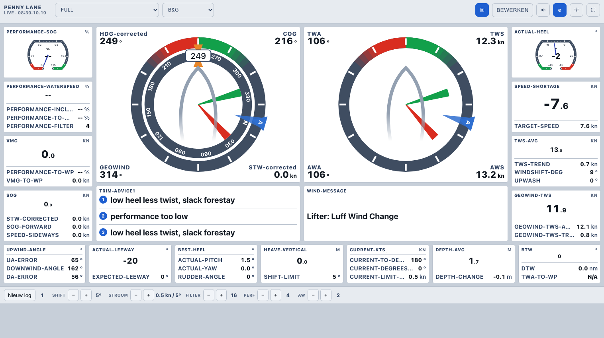
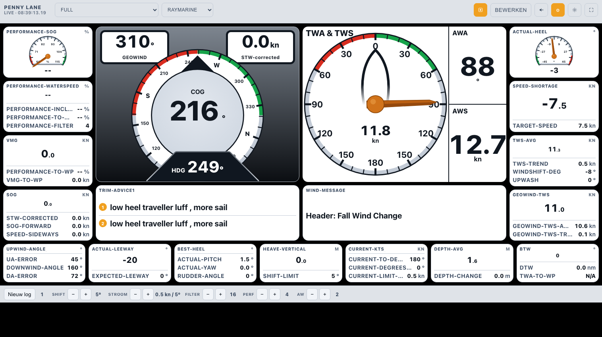
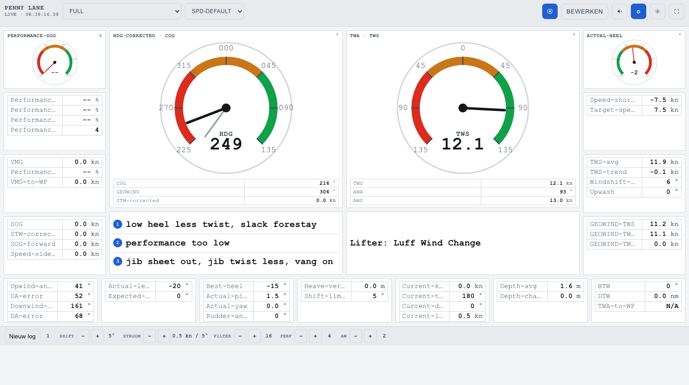

# SailingPD Starter Kit

**Maak [SailingPD](https://www.capolavoro.nl/manual-sailingpd) toegankelijk voor iedereen**, zonder `.ini`-bestanden te bewerken.

Deze starter kit bundelt twee dingen die het opstarten met SailingPD een stuk eenvoudiger maken:

1. **Config-wizard**: een browser-wizard die je stap voor stap door alle instellingen leidt, met uitleg in gewone taal, een woordenlijst, een "Test verbinding & detecteer sensoren"-knop, en een basismodus die alleen de essentiële stappen toont. Werkt op **Windows, Linux en Raspberry Pi**.
2. **Dashboard-menu** op poort 9090. Naast alle **16 originele SailingPD-schermen** (elk met een pictogram en korte toelichting) zit er een eigen, **configureerbaar dashboard**: de koers- en windmeter staan groot in het "hart" van het scherm, met het trimadvies en de wind-/stroomboodschap eronder en de overige waarden eromheen. Je kiest zelf een van **vier stijlen** (SPD-Default, Modern, Raymarine of B&G) en past de tegels zelf aan (per tegel: welk veld, meter/getal/balk, en de grootte). De wizard zet dit menu met één klik als startpagina.


> Onafhankelijke add-on. SailingPD zelf is gemaakt door Thomas ten Kortenaar (capolavoro.nl); deze kit is daar geen officieel onderdeel van maar werkt er bovenop.

---

## Het configureerbare dashboard

De koers- en windmeter staan groot in het "hart" van het scherm, met coaching (trimadvies en de wind-/stroomboodschap) eronder en de overige waarden eromheen. Je kiest zelf een stijl en past de tegels naar smaak aan. Hieronder dezelfde Full-weergave in drie stijlen: B&G, Raymarine en SPD-Default.







Voor oude toestellen (bijvoorbeeld een iPad 2) is er een lichte "legacy"-versie; die bereik je door `/legacy.html` achter het adres te zetten (bijvoorbeeld `localhost:9090/legacy.html`).

---

## Wat heb je nodig?

- **SailingPD** geïnstalleerd (download bij [capolavoro.nl](https://www.capolavoro.nl/manual-sailingpd)): Windows 10/11, 64-bit Linux, of Raspberry Pi.
- **Windows:** niets extra's. De wizard is een los programma (`SailingPD instellen.exe`), geen Python nodig.
- **Linux / Raspberry Pi:** Python 3.9+ (meestal al aanwezig).
- Geen internet nodig na installatie.

---

## Zo begin je

### Windows

1. Kopieer **`SailingPD instellen.exe`** in je SailingPD-map, naast `sailingPD.exe` en `web_root/`:

   ```
   SailingPD/
   ├── sailingPD.exe
   ├── web_root/
   ├── boatspecifics/
   └── SailingPD instellen.exe   ← hier
   ```

2. **Dubbelklik `SailingPD instellen.exe`.** De wizard opent vanzelf in je browser op **http://localhost:5001**, geen Python, geen installatie.
3. Doorloop de wizard. In de stap **WiFi & Webserver** zet je met één klik het **dashboard-menu** als startpagina. Klik aan het eind op **SailingPD starten**.
4. Open het dashboard op **http://localhost:9090/**.

### Linux / Raspberry Pi

1. Pak de map **`sailingpd-starterkit`** uit in (of naast) je SailingPD-installatiemap.
2. Start de wizard:

   ```bash
   ./sailingpd-starterkit/config-wizard/start.sh
   ```

   Open daarna **http://localhost:5001**. De eerste keer maakt het script automatisch een Python-omgeving aan.
3. Doorloop de wizard (het dashboard-menu installeer je met de knop in de stap **WiFi & Webserver**) en klik aan het eind op **SailingPD starten**.
4. Open het dashboard op **http://localhost:9090/**.

---

## Wat zit er in?

| Onderdeel | Inhoud |
|-----------|--------|
| `SailingPD instellen.exe` | De wizard als los Windows-programma (bevat het web-menu). Alleen in de release-download. |
| `config-wizard/` | De broncode van de wizard (Flask) voor Linux/Pi en ontwikkelaars. |
| `web-menu/` | De startpagina, het configureerbare dashboard (`panel.html`), het pagina-overzicht (`paginas.html`), de legacy-versie (`legacy.html`) en de thumbnails. De wizard plaatst deze in `web_root/`. |

De thumbnails in het menu zijn momentopnamen. Wijzigen de dashboardpagina's of wil je ze verversen met je eigen data? Maak nieuwe met een headless browser (bijv. `chromium --headless=new --screenshot=... http://localhost:9090/SPDfull.html`) en verklein ze naar ~480px breed in `web_root/thumbs/`.

---

## Terugdraaien

- **Dashboard-menu** terug naar de originele pagina: kopieer in `web_root/` het bestand `index.html.orig-spa` terug over `index.html` (de originele pagina blijft ook bereikbaar op `/dials.html`).
- **Wizard** verwijderen: verwijder `SailingPD instellen.exe` (Windows) of de map `sailingpd-starterkit` (Linux/Pi). De wizard verandert niets aan SailingPD zelf, alleen aan je configuratiebestanden.

---

## Licentie & dank

Deze kit is een onafhankelijke add-on voor SailingPD en wordt gedeeld onder dezelfde voorwaarden als SailingPD zelf. Met dank aan Thomas ten Kortenaar voor SailingPD.
