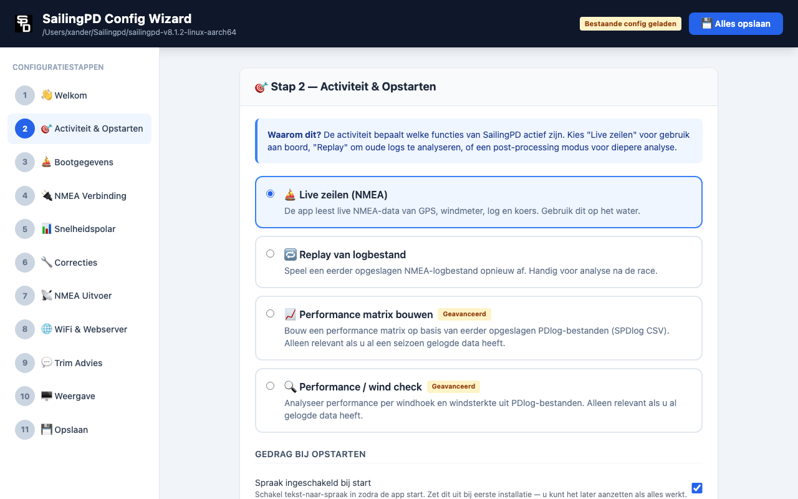

# SailingPD Config Wizard

Een browser-gebaseerde configuratiewizard voor [SailingPD](https://github.com/xanderburchartz/sailingpd) — het sailing performance dashboard voor racende zeilers op een Raspberry Pi.


---

## Wat doet het?

De Config Wizard leidt u stapsgewijs door alle instellingen van SailingPD. U hoeft geen `.ini`-bestanden handmatig te bewerken. De wizard legt bij elke stap uit waarom een instelling nodig is en schrijft aan het einde de juiste configuratiebestanden weg.

**11 stappen:**

| # | Stap | Inhoud |
|---|------|--------|
| 1 | Welkom | Uitleg over SailingPD en de wizard |
| 2 | Activiteit & Opstarten | Live zeilen, replay, of analyse; gedrag bij opstarten |
| 3 | Bootgegevens | Bootnaam, windmeterhoogte, Leeway K-factor, bootfoto |
| 4 | NMEA Verbinding | Netwerk (UDP/TCP) of serieel; kalibratie-instellingen |
| 5 | Snelheidspolar | Polar uploaden of aanmaken |
| 6 | Correcties | Kompasdeviatie, STW-correctie, hiel polar (optioneel) |
| 7 | NMEA Uitvoer | Welke NMEA-berichten en logbestanden SailingPD genereert |
| 8 | WiFi & Webserver | UDP broadcast en ingebouwde webserver |
| 9 | Trim Advies | Trim-adviezen en drempelwaarden |
| 10 | Weergave | Headless modus, lettertype en vensterdimensies |
| 11 | Opslaan & Starten | Samenvatting, configuratie opslaan, SailingPD starten |

| | |
|--|--|
|  |  |
|  |  |

---

## Vereisten

- **Raspberry Pi 4 of 5** met SailingPD geïnstalleerd
- **Python 3.9+** (standaard aanwezig op Raspberry Pi OS)
- Geen internetverbinding nodig na installatie

---

## Installatie

1. Zet de map `config-wizard/` in uw SailingPD-installatiemap:

```
sailingpd-vX.X.X/
├── config-wizard/      ← hier
├── boatspecifics/
├── systemfiles/
├── sailingPD
└── ...
```

2. Maak het startscript uitvoerbaar:

```bash
chmod +x config-wizard/start.sh
```

---

## Starten

```bash
cd sailingpd-vX.X.X/config-wizard
./start.sh
```

De eerste keer wordt automatisch een Python virtual environment aangemaakt en worden de benodigde packages (Flask, Pillow) geïnstalleerd.

Open daarna in de browser op de RPi:

```
http://localhost:5001
```

Of vanaf een ander apparaat op hetzelfde netwerk:

```
http://[ip-van-rpi]:5001
```

> **Tip:** het IP-adres van de RPi vindt u met `hostname -I` in een terminal.

---

## Configuratiebestanden

De wizard schrijft naar drie bestanden in de SailingPD-installatiemap:

| Bestand | Inhoud |
|---------|--------|
| `boatspecifics/boatspecifics.ini` | Bootgegevens, NMEA-verbinding, trim-instellingen |
| `systemfiles/processlist.ini` | Opstartgedrag, weergave, drempelwaarden |
| `systemfiles/sendoverwifi.ini` | WiFi, UDP en webserver-instellingen |
| `systemfiles/headless.txt` | Aanwezig = headless modus aan |

CSV-bestanden (polars, deviatie, etc.) worden direct opgeslagen wanneer u ze aanmaakt of uploadt in de betreffende stap.

---

## SailingPD starten vanuit de wizard

Op de laatste stap kunt u SailingPD direct starten via de groene knop **▶ SailingPD starten**. De wizard blijft bereikbaar — SailingPD draait als een losstaand achtergrondproces.

---

## Technische details

| | |
|-|-|
| Backend | Python / Flask |
| Frontend | Vanilla JavaScript, Tailwind CSS (CDN) |
| Poort | 5001 (instelbaar via `PORT` omgevingsvariabele) |
| Dependencies | `flask>=3.0.0`, `Pillow>=10.0.0` |
| Geen build-stap nodig | — |

---

## Versies

| Versie | Datum | Wijzigingen |
|--------|-------|-------------|
| v0.1.0 | 2026-05-21 | Eerste release — volledige 11-stappen wizard |

---

## Licentie

Dit project is een add-on voor SailingPD en wordt verspreid onder dezelfde voorwaarden als SailingPD zelf.
