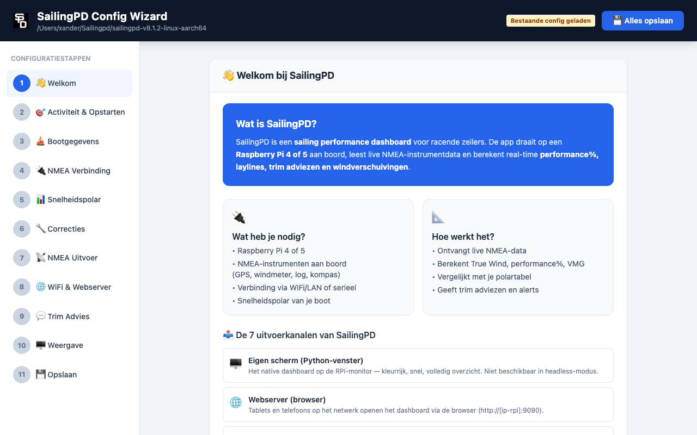
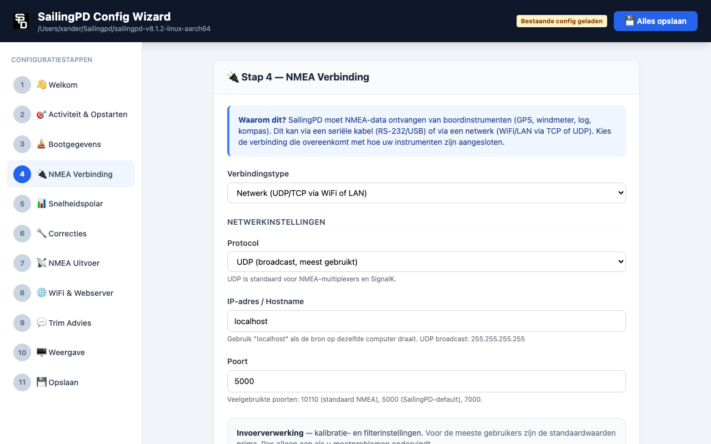
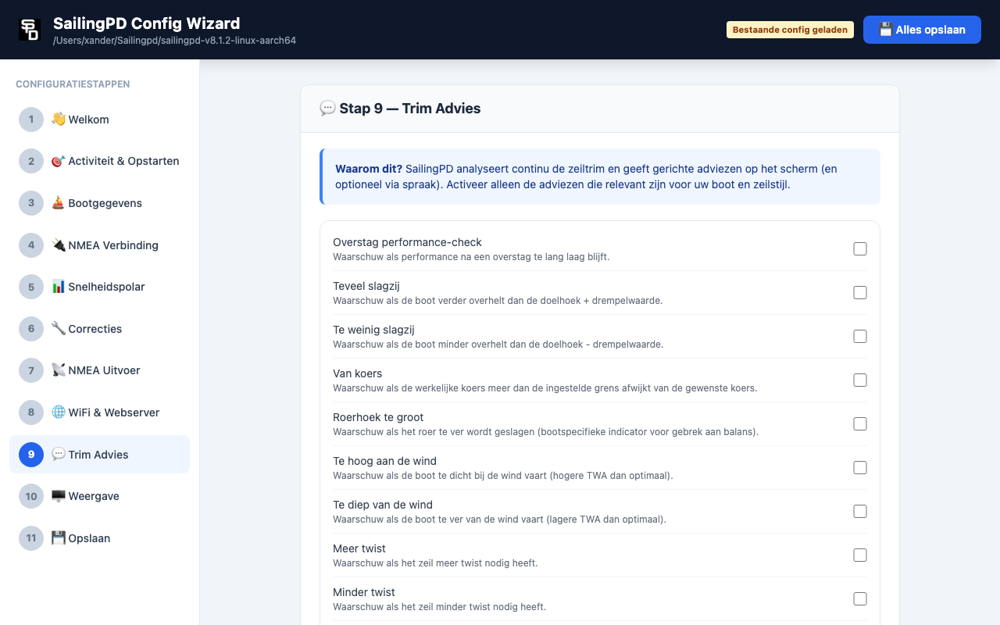
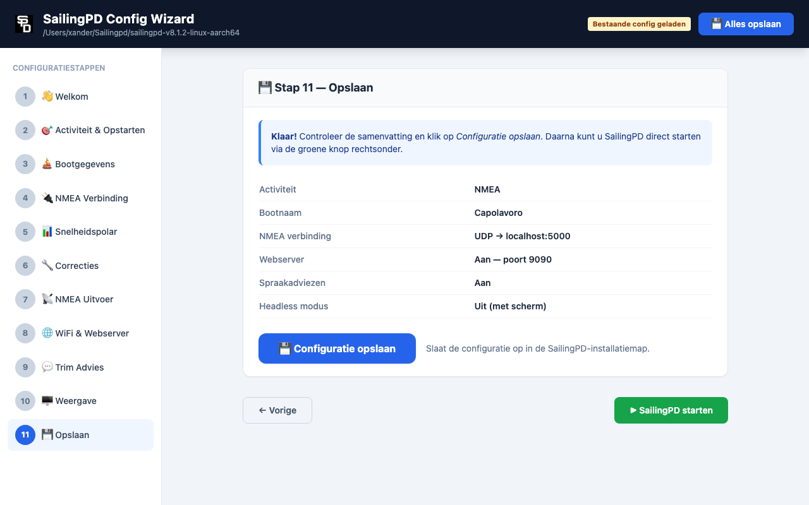

# SailingPD Config Wizard

Een browser-gebaseerde configuratiewizard voor [SailingPD](https://github.com/xanderburchartz/sailingpd) — het sailing performance dashboard dat live laat zien hoe goed je vaart en waar snelheidswinst zit. Draait op Windows, Linux of een Raspberry Pi.



---

## Wat doet het?

De Config Wizard leidt u stapsgewijs door alle instellingen van SailingPD. U hoeft geen `.ini`-bestanden handmatig te bewerken. De wizard legt bij elke stap uit waarom een instelling nodig is en schrijft aan het einde de juiste configuratiebestanden weg.

**11 stappen:**

| # | Stap | Inhoud |
|---|------|--------|
| 1 | Welkom | Uitleg over SailingPD en de wizard |
| 2 | Activiteit | Wat wil je doen: live zeilen, uitproberen zonder instrumenten, naspelen of analyse |
| 3 | Bootgegevens | Bootnaam, windmeterhoogte, Leeway K-factor, bootfoto |
| 4 | NMEA Verbinding | Netwerk (UDP/TCP) of serieel; kalibratie-instellingen |
| 5 | Snelheidspolar | Polar uploaden of aanmaken |
| 6 | Correcties | Kompasdeviatie, STW-correctie, hiel polar (optioneel) |
| 7 | NMEA Uitvoer | Welke NMEA-berichten en logbestanden SailingPD genereert |
| 8 | WiFi & Webserver | UDP broadcast en ingebouwde webserver |
| 9 | Trim Advies | Trim-adviezen en drempelwaarden |
| 10 | Weergave | Headless modus, lettertype en vensterdimensies |
| 11 | Opslaan & Starten | Samenvatting, configuratie opslaan, SailingPD starten |

| | |
|--|--|
|  |  |
|  |  |

---

## Vereisten

- **Windows 10/11, 64-bit Linux, of Raspberry Pi** met SailingPD geïnstalleerd
- **Windows:** géén Python nodig als u `SailingPD-ConfigWizard.exe` gebruikt — dubbelklikken volstaat. Wilt u vanaf de broncode werken (`start.bat`), dan wél **Python 3.9+** (van [python.org](https://www.python.org/downloads/), met *"Add Python to PATH"* aangevinkt)
- **Linux / Raspberry Pi:** **Python 3.9+**, meestal al aanwezig
- Geen internetverbinding nodig na de eerste installatie

---

## Installatie

1. Zet de map `config-wizard/` in uw SailingPD-installatiemap:

```
sailingpd-vX.X.X/
├── config-wizard/      ← hier
├── boatspecifics/
├── systemfiles/
├── sailingPD
└── ...
```

2. Maak het startscript uitvoerbaar:

```bash
chmod +x config-wizard/start.sh
```

---

## Starten

**Windows** — dubbelklik op **`SailingPD instellen.exe`**: die heeft geen Python nodig, vindt uw SailingPD-map zelf en opent de browser. Werkt u vanaf de broncode, dubbelklik dan op **`start.bat`**. De eerste keer maakt het script automatisch een Python-omgeving aan, installeert Flask + Pillow en opent de browser. Verschijnt er "Python is niet gevonden"? Installeer Python 3.9+ (zie *Vereisten*).

**Linux / Raspberry Pi:**

```bash
cd sailingpd-vX.X.X/config-wizard
./start.sh
```

De eerste keer wordt automatisch een Python virtual environment aangemaakt en worden de benodigde packages (Flask, Pillow) geïnstalleerd.

Open daarna in de browser op dezelfde computer:

```
http://localhost:5001
```

Of vanaf een ander apparaat op hetzelfde netwerk:

```
http://[ip-adres]:5001
```

> **Tip:** het IP-adres vind je op **Windows** met `ipconfig` (Opdrachtprompt) en op **Linux/Raspberry Pi** met `hostname -I` (terminal).

---

## Configuratiebestanden

De wizard schrijft naar drie bestanden in de SailingPD-installatiemap:

| Bestand | Inhoud |
|---------|--------|
| `boatspecifics/boatspecifics.ini` | Bootgegevens, NMEA-verbinding, trim-instellingen |
| `systemfiles/processlist.ini` | Opstartgedrag, weergave, drempelwaarden |
| `systemfiles/sendoverwifi.ini` | WiFi, UDP en webserver-instellingen |
| `systemfiles/headless.txt` | Aanwezig = headless modus aan |

CSV-bestanden (polars, deviatie, etc.) worden direct opgeslagen wanneer u ze aanmaakt of uploadt in de betreffende stap.

---

## SailingPD starten vanuit de wizard

Op de laatste stap kunt u SailingPD direct starten via de groene knop **▶ SailingPD starten**. De wizard blijft bereikbaar — SailingPD draait als een losstaand achtergrondproces.

---

## Technische details

| | |
|-|-|
| Backend | Python / Flask (Multi-threaded) |
| Frontend | Vanilla JavaScript, Standalone Offline CSS |
| Poort | 5001 (instelbaar via `PORT` omgevingsvariabele) |
| Dependencies | `flask>=3.0.0`, `Pillow>=10.0.0` |
| Offline geschiktheid | 100% lokaal (geen externe CDN of internetverbinding vereist) |

---

## Versies

| Versie | Datum | Wijzigingen |
|--------|-------|-------------|
| v0.1.2 | 2026-08-12 | **Windows-release** (getest op Windows 11 met SailingPD v8.1.4):<br>- **Startbaar zonder Python**: de wizard is nu ook een losse `.exe` (PyInstaller). Dubbelklikken volstaat; hij vindt de SailingPD-map zelf en opent de browser.<br>- **SailingPD startte niet in web-modus**: `systemfiles/startupfiles.ini` ontbrak, waardoor SPD afbrak met *"Deadly Error. Headless cannot be combined with no for same start files"*. De wizard schrijft dat bestand nu.<br>- **Crash bij opstarten op Nederlandse Windows** (`UnicodeEncodeError` op codepagina cp1252) verholpen.<br>- **Replay klopte niet**: `replay` werd als *activiteit* weggeschreven, maar SailingPD kent alleen `activity = NMEA` plus `[Mode] replay = Y`. Replay is nu een aparte schakelaar, met een waarschuwing dat het schermmodus vereist.<br>- **Startscripts** herstellen zich nu na een afgebroken pip-installatie. |
| v0.1.1 | 2026-08-11 | **Bugfix & Optimalisatie Release**:<br>- **Windows Opslag Bugfix**: Knop `#btn-save` verplicht gekoppeld aan `saveAndStart()` en slimme `_find_sailing_dir` mappendetectie toegevoegd.<br>- **100% Offline CSS**: Externe Tailwind CDN vervangen door lokaal gegenereerde Tailwind-CSS (CLI-build v3.4.17, alle gebruikte klassen gedekt; hergenereer-instructies staan in `templates/index.html`).<br>- **Performance**: Flask multi-threading ingeschakeld (`threaded=True`) en NMEA test socket timeout verkort.<br>- **Beveiliging**: Path traversal opschoning op alle CSV endpoints.<br>- **Scripting**: `python3-venv` controle in `start.sh` toegevoegd. |
| v0.1.0 | 2026-05-21 | Eerste release — volledige 11-stappen wizard |

---

## Licentie

Dit project is een add-on voor SailingPD en wordt verspreid onder dezelfde voorwaarden als SailingPD zelf.
